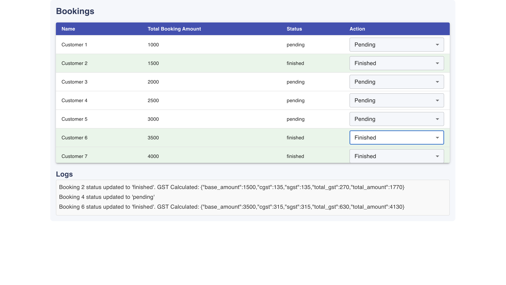

# Automated GST Invoice Generation Project

## Project Structure

```
GST/
├── API/
│   ├── __init__.py
│   ├── main.py      
│
├── gst-bookings/
│   ├── src
│       └── App.js
│       └── BookingsTable.js
│
├── Server
    ├── server.js   
```

## Overview
This project is designed to automate GST invoice generation by calculating GST based on booking amounts and providing real-time updates through a web interface. It consists of a backend API developed with FastAPI, a server-side application using Express.js, and a frontend built with React.js.

## Components

### Backend API (FastAPI)
**File:** `API/main.py`
- This API provides an endpoint `/calculate_gst` to calculate the GST based on the total booking amount.
- It uses FastAPI with CORS middleware to handle cross-origin requests.

**Key Features:**
- Receives booking data.
- Calculates CGST and SGST (each at 9% of the total booking amount).
- Returns the GST details and total amount.

### Server Application (Express.js)
**File:** `Server/server.js`
- Manages booking data stored in MongoDB.
- Provides endpoints to fetch and update bookings.
- Uses Socket.IO for real-time updates and logs.

**Key Features:**
- Connects to MongoDB using Mongoose.
- Supports real-time data updates with Socket.IO.
- Integrates with the FastAPI backend to calculate GST.

### Frontend Application (React.js)
**Files:**
- `gst-bookings/src/App.js`
- `gst-bookings/src/BookingsTable.js`

**Key Features:**
- Displays a list of bookings with their details.
- Allows updating the booking status.
- Shows real-time logs and booking updates using Socket.IO.

## UI Layout

### Layout Image


## Installation and Setup

### Prerequisites
- Node.js
- Python 3.8+
- MongoDB

### Steps
1. **Clone the repository:**
   ```bash
   git clone (https://github.com/Sachin24063/GST-Invoice.git)
   cd GST-Invoice
   ```

2. **Backend Setup (FastAPI):**
   ```bash
   cd API
   python -m venv venv
   source venv/bin/activate  # On Windows: venv\Scripts\activate
   pip install fastapi[all] pydantic
   uvicorn main:app --reload
   ```

3. **Server Setup (Express.js):**
   ```bash
   cd Server
   npm install
   node server.js
   ```

4. **Frontend Setup (React.js):**
   ```bash
   cd gst-bookings/src
   npm install
   npm start
   ```

### Environment Variables
- Create a `.env` file in the `Server` directory and set the following:
  ```env
  PORT=5001
  MONGO_URI=<your-mongodb-connection-string>
  GST_API_URL=http://localhost:8000/calculate_gst
  ```

## Usage
1. Start the FastAPI backend and Express server.
2. Open the React frontend by navigating to `http://localhost:3000`.
3. Manage bookings and view real-time updates and logs.

## API Endpoints

### FastAPI
- `POST /calculate_gst`: Calculates GST based on the total booking amount.

### Express.js
- `GET /bookings`: Fetch all bookings.
- `PUT /bookings/:id`: Update the status of a booking.
